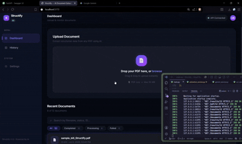
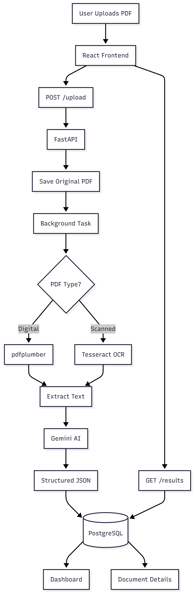

> Deployment: see [DEPLOYMENT.md](DEPLOYMENT.md) for Vercel + Render Free + Neon with temporary PDFs.

<h1 align="center">
  <br>
  
  <br><br>
  Structify — AI Document Extraction
</h1>

<p align="center">
  Upload any PDF. Get clean, structured JSON — powered by Gemini AI.
</p>

<p align="center">
  
  
  
  
  
  
  
</p>

---

## 📖 Overview

**Structify** is a full-stack AI powered document extraction system. Drop in a PDF  digital or scanned and Structify automatically extracts all meaningful fields into structured JSON using a smart dual-pipeline: native text parsing for digital PDFs, and Tesseract OCR for scanned images, both routed through **Google Gemini 2.5 Flash** for intelligent data structuring.

Structify automates extraction of structured information from PDF documents.

Instead of manually reading invoices or scanned documents, users can upload a PDF and receive structured JSON that can be stored, searched, or integrated into downstream systems.

The result is instantly viewable in a JSON viewer, copyable to clipboard, and downloadable as a `.json` file — A React dashboard for uploading, monitoring and viewing extracted documents..

---

## 🎬 Demo



> **▶ [Watch the full demo video on Google Drive](https://drive.google.com/file/d/1WOl_qTwRvNO56OQ-oB2RlwviAZGAi7_S/view?usp=sharing)**


---

##  Features

### Backend
-  **PDF Upload** — validates file type (`.pdf` only) and enforces a 20 MB size limit
-  **Non-blocking Processing** — upload returns instantly; extraction runs as a FastAPI background task
-  **Dual Extraction Pipeline** — pdfplumber for digital PDFs → Tesseract OCR fallback for scanned documents
-  **Gemini AI Structuring** — raw extracted text is sent to Gemini 2.5 Flash with a strict prompt that returns clean, validated JSON (no hallucinations, null-safe, date-normalized)
-  **Status Tracking** — documents cycle through `processing` → `completed` / `failed`
-  **Temporary PDFs** — originals are deleted after processing; extracted results persist in Neon

### Frontend
-  **Drag-and-Drop Upload Zone** — with real-time HTTP upload progress bar
-  **Live Polling** — auto-polls every 2 seconds until extraction completes or fails
-  **3-Stage Pipeline Tracker** — visual Uploading → Processing → Complete stepper
-  **Dashboard** — stat cards, recent documents (last 8), search, and filter chips
-  **History Page** — full document list with live search by filename / status / ID
-  **Document Detail View** — saved metadata and a full-width JSON tree
-  **Recursive JSON Tree Viewer** — collapsible, type-colored, with smart formatting:
  - Numeric amounts → `₹25,000` (Indian locale)
  - ISO dates → `12 Jun 2025`
  - Null values → `Not Available`
-  **Copy JSON** to clipboard & **⬇ Download JSON** as a file
-  **Responsive** — mobile sidebar overlay, responsive result layouts

---

##  Screenshots

### Dashboard
> Upload zone, live stats, and recent documents — all in one dark-mode dashboard.


---

### Document Detail — Historical Screenshot
> This older screenshot shows the previous preview layout. The current app displays JSON only and deletes original PDFs.


---

### API — POST /upload (Swagger UI)
> Upload a PDF and receive a `task_id` immediately. Processing happens asynchronously in the background.


---

### API — GET /results/{document_id} (Swagger UI)
> Poll by `task_id` to retrieve the fully structured JSON once Gemini has processed the document.


---

##  Architecture



---

##  Database Schema

Single table: **`documents`**

| Column | Type | Description |
|---|---|---|
| `id` | `INTEGER` PK | Auto-increment |
| `filename` | `VARCHAR` | Original filename |
| `pdf_type` | `VARCHAR` | `"digital"` or `"scanned"` |
| `processing_method` | `VARCHAR` | `"pdfplumber"` or `"tesseract"` |
| `status` | `VARCHAR` | `"processing"` / `"completed"` / `"failed"` |
| `raw_text` | `TEXT` | Full extracted text before AI |
| `structured_json` | `JSONB` | Final AI-structured output |
| `error_message` | `TEXT` | Processing failure details |
| `updated_at` | `TIMESTAMPTZ` | Last update time |
| `created_at` | `TIMESTAMPTZ` | Auto-set on insert |

---

##  API Endpoints

Base URL: `http://localhost:8000`

| Method | Endpoint | Description |
|---|---|---|
| `POST` | `/upload` | Upload a PDF file for processing |
| `GET` | `/results/{document_id}` | Poll extraction status and get structured data |
| `GET` | `/documents` | List all documents (newest first) |
| `GET` | `/pdf/{document_id}` | Deprecated: returns 410; originals are deleted |

Interactive API docs available at `http://localhost:8000/docs` (Swagger UI).

---

##  Tech Stack

| Layer | Technology |
|---|---|
| **Backend Framework** | FastAPI + Uvicorn |
| **AI / LLM** | Google Gemini 2.5 Flash (`google-genai`) |
| **Digital PDF Parsing** | pdfplumber |
| **OCR Engine** | Tesseract + pytesseract |
| **PDF → Image** | pdf2image + Poppler |
| **Database** | PostgreSQL (Neon serverless) via SQLAlchemy |
| **Frontend** | React 19 + Vite 8 |
| **Routing** | React Router DOM v7 |
| **HTTP Client** | Axios |
| **Styling** | Vanilla CSS with CSS custom properties |
| **Fonts** | Inter (UI) · JetBrains Mono (code) |

---

## Free-tier deployment

React/Vite → **Vercel Hobby**; FastAPI/Docker → **Render Free**;
PostgreSQL → **Neon Free**; OCR → **Tesseract + Poppler**; AI → **Gemini**.

Uploaded PDFs live only in `/tmp` in Docker. Background processing stores JSON,
raw extracted text and metadata in Neon, then deletes the original PDF. No object
storage or persistent disk is needed. The detail page displays retained results;
original-PDF preview is disabled.

Backend settings: `DATABASE_URL`, `GEMINI_API_KEY`, `CORS_ORIGINS`, plus optional
`GEMINI_MODEL`. Frontend: `VITE_API_BASE_URL=https://<backend>.onrender.com`.
Use free plans without enabling paid billing. Render can independently request
account verification; see [DEPLOYMENT.md](DEPLOYMENT.md) for that limitation and
exact setup steps. Free instances may sleep and take longer on the first request.

##  Getting Started

### Prerequisites

Make sure the following are installed on your system:

- Python 3.11+
- Node.js 24.x
- [Tesseract OCR](https://github.com/UB-Mannheim/tesseract/wiki) (Windows installer)
- [Poppler for Windows](https://github.com/oschwartz10612/poppler-windows/releases)
- A [Google Gemini API key](https://aistudio.google.com/app/apikey)
- A [Neon PostgreSQL](https://neon.tech) database (or any PostgreSQL instance)

---

### 1. Clone the Repository

```bash
git clone https://github.com/your-username/structify.git
cd structify
```

---

### 2. Backend Setup

```bash
cd backend
python -m venv venv

# Windows
venv\Scripts\activate

# macOS / Linux
source venv/bin/activate

pip install -r requirements.txt
```

Copy `backend/.env.example` to `backend/.env` and fill in `DATABASE_URL`,
`GEMINI_API_KEY` and `CORS_ORIGINS`. See
[DEPLOYMENT.md](DEPLOYMENT.md) for exact Neon and deployment setup. For native
Windows OCR only, set `TESSERACT_PATH` and `POPPLER_PATH` if not on PATH; leave
both unset in Docker. Never put backend credentials in frontend variables.

Start the backend:

```bash
uvicorn main:app --reload --host 0.0.0.0 --port 8000
```

The API will be live at `http://localhost:8000`
Interactive docs at `http://localhost:8000/docs`

---

### 3. Frontend Setup

```bash
cd frontend
npm ci
npm run dev
```

The app will be live at `http://localhost:5173`

---

##  Project Structure

```
structify/
├── backend/
│   ├── main.py                   # FastAPI app + all route definitions
│   ├── requirements.txt
│   ├── .env                      # Environment variables (never commit this)
│   └── app/
│       ├── config.py             # Settings class
│       ├── database/
│       │   ├── connection.py     # SQLAlchemy engine + session
│       │   └── models.py         # Document ORM model
│       ├── crud/
│       │   └── document_crud.py  # DB operations
│       └── services/
│           ├── extraction_service.py  # Smart dispatch: pdfplumber → OCR
│           ├── pdf_service.py         # pdfplumber digital extraction
│           ├── ocr_service.py         # Tesseract OCR for scanned PDFs
│           └── gemini_service.py      # Gemini prompt + JSON parsing
│
└── frontend/
    ├── index.html
    ├── vite.config.js
    ├── package.json
    └── src/
        ├── App.jsx               # Root layout + routing
        ├── api/documentApi.js    # Axios instance + API functions
        ├── hooks/
        │   ├── useUpload.js      # Upload + polling state machine
        │   └── useDocuments.js   # Fetch list + fetch single doc
        ├── pages/
        │   ├── Dashboard.jsx     # Upload + stats + recent docs
        │   ├── DocumentDetail.jsx # Split PDF+JSON view
        │   └── History.jsx       # Full history with search & filter
        ├── components/
        │   ├── upload/UploadCard.jsx   # Drag-drop zone + progress stages
        │   ├── JSONViewer.jsx          # Recursive collapsible JSON tree
        │   └── documents/             # DocumentCard + DocumentList
        ├── styles/               # CSS tokens, global, components, animations
        └── utils/formatters.js   # formatKey, formatValue, formatCurrency
```

---

##  How the AI Pipeline Works

1. **Upload** — PDF is copied to a unique temporary directory and a DB record is created with `status="processing"`
2. **Text Extraction** — `extraction_service.py` first attempts `pdfplumber` (fast, lossless for digital PDFs). If no text layer is found, it falls back to `Tesseract OCR` via `pdf2image`
3. **AI Structuring** — The extracted raw text is sent to **Gemini 2.5 Flash** with a strict prompt:
   - Never hallucinate — missing fields return `null`
   - Correct unambiguous OCR errors (`O→0`, `l→1`, `S→5`)
   - Dates must be `YYYY-MM-DD`; amounts must be numbers
   - Return only valid JSON
4. **Storage** — Gemini's JSON response is parsed and stored in a `JSONB` column alongside the raw text, PDF type, and processing method
5. **Cleanup** — Temporary originals and OCR page images are removed on success or failure; only extracted results and metadata persist.
6. **Retrieval** — Frontend polls `GET /results/{id}` every 2 seconds until `status` is no longer `"processing"`

---

##  Potential Improvements

- [x] Docker backend with Tesseract + Poppler
- [x] `.env.example` template file
- [ ] Alembic database migrations
- [ ] Authentication & per-user document isolation
- [ ] WebSocket push instead of polling
- [ ] Support for multi-page document chunking
- [ ] Export to CSV / Excel in addition to JSON
- [ ] Configurable AI prompt / custom schema extraction

---

